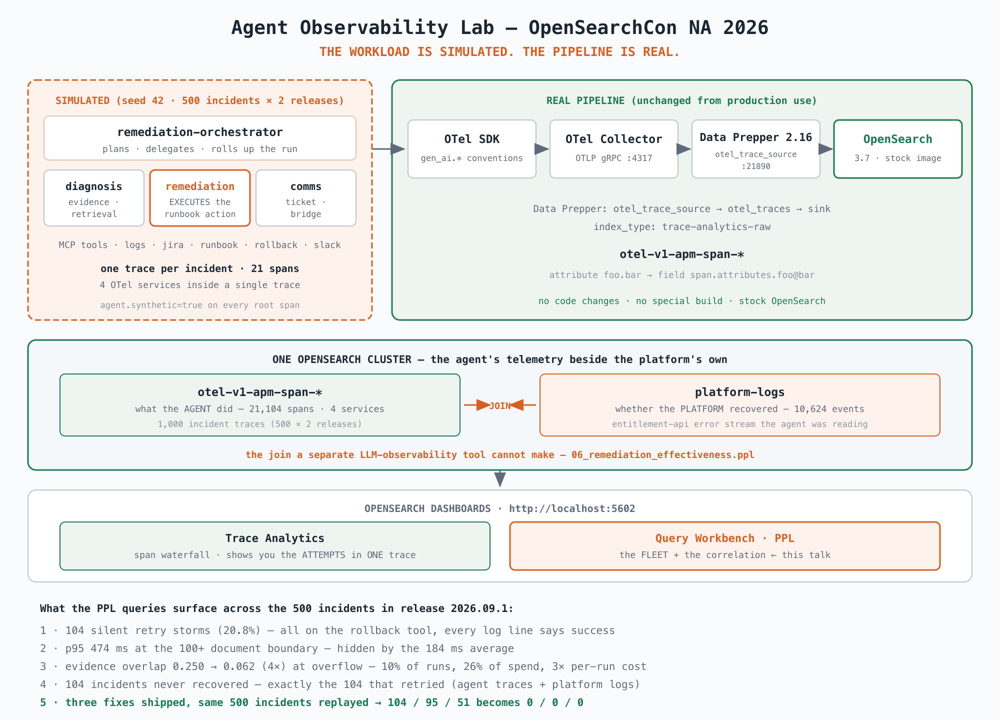

# opensearch-agent-trace-lab

**Debug AI agents like distributed systems.** OpenTelemetry spans through Data Prepper
into OpenSearch, ten PPL investigations, and the cross-index join that answers the
question a dedicated LLM-observability tool structurally cannot: *did the agent's action
actually work?*

[](https://github.com/eilhamv/cfp-opensearch/actions/workflows/reproduce.yml)
[](LICENSE)
[](https://opensearch.org/)
[](https://opentelemetry.io/)

Companion lab for the OpenSearchCon North America 2026 talk
*Your Agent Is a Distributed System*.

---

## The finding

A multi-agent remediation platform handled 500 incidents in one live-event window and
reported success on every one. **104 of them never recovered.**

The rollback tool had silently retried. The logical call succeeded, so the application log
recorded one success and the trace-level error count stayed at zero — but the per-attempt
spans show two physical executions of a production change, and the operator's *own* error
stream, sitting in the same OpenSearch cluster, shows the platform never settled.

That chain — silent retry → double-executed rollback → platform never recovered → agent
reported success anyway — is visible only because the agent's traces and the platform's
logs live in one place. This repo reproduces all of it, exactly, on your laptop.

## Quickstart

```bash
git clone https://github.com/eilhamv/cfp-opensearch && cd cfp-opensearch
pip install -r requirements.txt
make demo      # stack + 21,104 spans + 10,624 log events  (~8 min)
make check     # assert every published number; non-zero exit on any mismatch
```

Then open **http://localhost:5602** and paste any file from [`queries/`](queries/) into
Query Workbench. Every expected result is in the file's comments.

Requires Docker (or Podman) with ~4 GB free, and Python 3.10+.



<sub>Vector source: [assets/architecture.svg](assets/architecture.svg) — regenerate the PNG with `rsvg-convert -w 2000 assets/architecture.svg -o assets/architecture.png`</sub>

## What you can take from it

- **A span schema for multi-agent platforms** — one trace per incident across four OTel
  services, physical tool attempts as first-class child spans, and root-span rollups that
  make fleet triage a single query. [docs/span-schema.md](docs/span-schema.md)
- **Ten PPL investigations** that run on a stock OpenSearch cluster, no special build.
- **The verification pattern** — joining agent traces to operational telemetry to prove an
  action worked. [docs/why-not-an-llm-obs-saas.md](docs/why-not-an-llm-obs-saas.md)
- **Three alerting monitors** that route agent failures through your existing on-call
  rather than a second console. [alerting/](alerting/)
- **Privacy-safe span design** — counts, buckets, booleans and ratios; never prompts,
  documents or identifiers. [docs/privacy-and-redaction.md](docs/privacy-and-redaction.md)
- **~30 lines to instrument your own agent.**
  [docs/instrument-your-agent.md](docs/instrument-your-agent.md)

> **How the data is made.** The workload is a deterministic replay: the Python agent emits
> seeded LLM completions and MCP-inspired tool responses (seed 42, 500 incidents across two
> releases), and every trace is flagged `agent.synthetic=true` on its root span. The OTel
> SDK, Collector, Data Prepper pipeline, OpenSearch indices, PPL queries and alerting
> monitors are the production ones. That is why counts, ratios, tokens and costs are exact
> and reproduce anywhere — full story in [docs/case-study.md](docs/case-study.md).

---

## The talk

|  |  |
|---|---|
| **Session** | Your Agent Is a Distributed System: Debugging AI Failures with OpenTelemetry and OpenSearch |
| **Event** | [OpenSearchCon North America 2026](https://events.linuxfoundation.org/opensearchcon-north-america/), San Jose, 22–24 September 2026 |
| **When** | Wednesday 23 September, 10:50 — San Jose Ballroom Salon I-II |
| **Track** | Analytics, Security & Observability · 20 minutes |
| **Speakers** | Harishankar Menderkar · Sarat Chandra Ventrapragada |
| **Slides** | [slides.pdf](slides.pdf) |
| **Recording** | *link added after the conference publishes it* |

Everything shown on stage runs from this repository. `make demo` builds the
dataset and `make check` asserts every number in the slides against it.

---

## What's in the box

```
docker-compose.yml               OpenSearch 3.7 · Dashboards 3.7 · Data Prepper 2.16 · OTel Collector
otel-collector-config.yaml       OTLP receiver → batch → Data Prepper exporter
data-prepper-pipelines.yaml      otel_trace_source → otel_traces → OpenSearch (trace-analytics-raw)
data-prepper-config.yaml         Data Prepper server config
Makefile                         up · generate · queries · check · demo · reset · status · down · clean
requirements.txt                 Pinned OTel SDK + exporter (versions must match!)
src/agent_trace_lab/agent.py     The instrumented agent — all span names and attributes
queries/00_triage.ppl            Fleet triage — start here: which runs are unhealthy, by signal
queries/01–05*.ppl               The five deep-dive investigations, expected results inline
queries/06_remediation_effectiveness.ppl  Did the platform actually recover? (joins platform-logs)
queries/07_release_comparison.ppl         Before/after: the same 500 incidents, fixes applied
queries/08_effectiveness_join.ppl         The join, LITERALLY: retried incidents matched by
                                          identity to unrecovered errors (PPL cross-index join)
queries/preflight.ppl            Ingestion sanity check before going on stage
queries/find_bugs.py             Runs all queries via the API and prints results
DEMO.md                          Bring the lab up, verify the numbers, shut down
LICENSE                          Apache-2.0
CODE_OF_CONDUCT.md               Contributor Covenant 2.1
SECURITY.md                      Why the lab credential is public; how to report a real issue
docs/case-study.md               The production incident this lab reproduces
docs/production-sizing.md        "How big at real traffic?" — sizing model, measured constants
docs/why-not-an-llm-obs-saas.md  Honest positioning vs Langfuse/LangSmith/Phoenix
alerting/                        Three monitors: agent failures page the existing on-call
docs/span-schema.md              Full span hierarchy, dual-attribute strategy, field mapping
docs/instrument-your-agent.md    The minimal span set for YOUR agent — the ~30 lines that matter
docs/privacy-and-redaction.md    What never enters a span, and how the pipeline enforces it
.github/workflows/reproduce.yml  CI: full pipeline from scratch + `make check` on every push
assets/architecture.svg/.png     The diagram above (SVG is the source; PNG is what README embeds)
slides.pdf                       The talk's slides — 13 pages (presenter notes not included)
aws/                             Optional CDK deployment: one stoppable EC2 instance,
                                 SSM-only access, ~$2.40/mo when stopped — see aws/README.md
```

## Running it

The Quickstart above is the short path. The full set of targets:

```bash
make up        # start OpenSearch + Dashboards + Data Prepper + Collector, wait until ready
make generate  # emit 1,000 deterministic traces (500 incidents × 2 releases)
make demo      # both of the above

make status    # containers + indexed span count (expect exactly 21,104)
make queries   # re-run all ten PPL validations, printing results
make check     # STRICT: assert every published number; cross-checks BOTH counts
               # (21,104 spans AND 10,624 log events) and exits non-zero on mismatch
make reset     # wipe indexed data, keep the stack up — then `make generate`

make down      # stop containers, keep the data volume
make clean     # stop containers AND delete the data volume
```

> ⚠ The OTel SDK and OTLP exporter **must be the same version** — mixed versions fail at
> import with `No module named 'opentelemetry.sdk._shared_internal'`. `requirements.txt`
> pins both.

### Where to look in Dashboards

**http://localhost:5602** — `admin` / `Dem0.Trace.2026` (local lab only).

| What you want | Where to go |
|---|---|
| The span waterfall with the two retry attempts | Observability → **Trace Analytics → Traces**, then click the trace ID for the detail view |
| Agent DAG / Gantt / token rollups | Observability → **Agent Traces** — ships in the [Observability Stack](https://observability.opensearch.org/docs/ai-observability/agent-tracing/) distribution, not the stock image. Same index, so every query here is unchanged |
| The fleet-wide PPL investigations | **Query Workbench** (`/app/opensearch-query-workbench`, PPL tab) — paste raw PPL, results render as a table |

Both views read the same `otel-v1-apm-span-*` index this pipeline writes. **The PPL
investigations need neither UI** — they run against the index on any OpenSearch cluster.

> Trace Analytics applies a time filter and the dataset carries its generation timestamp,
> so widen the range if the Traces tab looks empty. Query Workbench has no time filter.

## The four investigations (and one bonus)

Every number below is asserted by `make check` against a live cluster, and CI
re-runs the whole pipeline from scratch and re-asserts them on every push.
**Counts, ratios, tokens and costs are exact everywhere** — the workload draws from
its own seeded generator (seed 42), separate from the OTel SDK's ID generator, so
they reproduce on any SDK version. **Latency figures are wall-clock**, so they move
a few milliseconds with machine speed; the stable claim there is the ~6.7× gap
between buckets, not the millisecond.

Run [00_triage.ppl](queries/00_triage.ppl) first — 500 runs, three unhealthy counts,
each pointing at the deep-dive below.

| # | Failure | Where logs fail you | The span truth |
|---|---|---|---|
| 1 | **Silent retry on the ACTION** | App log records one success | 104 incidents (20.8%) retried `rollback_mcp`; attempt spans answer "did it apply twice?" |
| 2 | **Latency hiding in averages** | Mean ~184ms looks green | `100+` doc bucket p95 ~474ms — **~6.7×** the `0-10` bucket |
| 3 | **Context underuse** | "The agent is sometimes wrong" | `evidence_overlap_ratio` collapses 0.250 → 0.062 exactly when `overflow_detected=true` |
| 4 | **Which agent is slow** | Unanswerable from logs | `serviceName` breakdown: **diagnosis = 71% of time-to-remediation** |
| ★ | **Cost attribution** | Invisible without token counts in spans | evidence-loss runs = ~10% of traffic, ~26% of spend, 3× per-run cost |

## Adapting to your real agent

Start with **[docs/instrument-your-agent.md](docs/instrument-your-agent.md)** — the
minimal span set (~30 lines) extracted from this lab, including where agent
frameworks plug into the same pipeline unchanged. Then swap the simulated tool
calls in `agent.py` for your real MCP servers — the instrumentation is identical.
Read `docs/span-schema.md` for the dual-attribute strategy
(experimental `gen_ai.*` conventions + stable custom fallbacks) and
`docs/privacy-and-redaction.md` **before** pointing this at production data.

## Versions

| Component | Version |
|---|---|
| OpenSearch / Dashboards | 3.7.0 |
| Data Prepper | 2.16.0 |
| OTel Collector (contrib) | 0.158.0 |
| OTel Python SDK + exporter | 1.32.1 (pinned, must match) |

## Troubleshooting

| Problem | Fix |
|---|---|
| Data Prepper crashes on start | The pipeline source must be `otel_trace_source:` (the plugin name) — check `docker logs data-prepper-lab` (or `podman logs`) |
| 0 spans after `make generate` | `docker logs otel-collector-lab \| grep -i error` (or `podman logs`); then `make down && make up` and retry |
| PPL returns empty | Data Prepper flushes in batches — wait 20s and retry |
| Numbers don't match the README | Old spans mixed in: `make reset && make generate` |
| Short of 21,104 spans | Generation started before the Collector's gRPC pipe to Data Prepper was usable, and the dropped spans are silent — no error anywhere. `make reset` now waits 45s for this; if you bypass reset, wait before generating. Re-run `make reset && make generate`. |
| `06_remediation_effectiveness.ppl` returns 208, not 104 | `platform-logs` was not cleared before regenerating, so two runs are stacked (every `incident_id` is a fresh UUID, so nothing looks duplicated). `make reset` deletes it now — re-run `make reset && make generate`. |
| Port 9201/5602/4317/21890 busy | `lsof -i :<port>` and stop the conflicting process |
